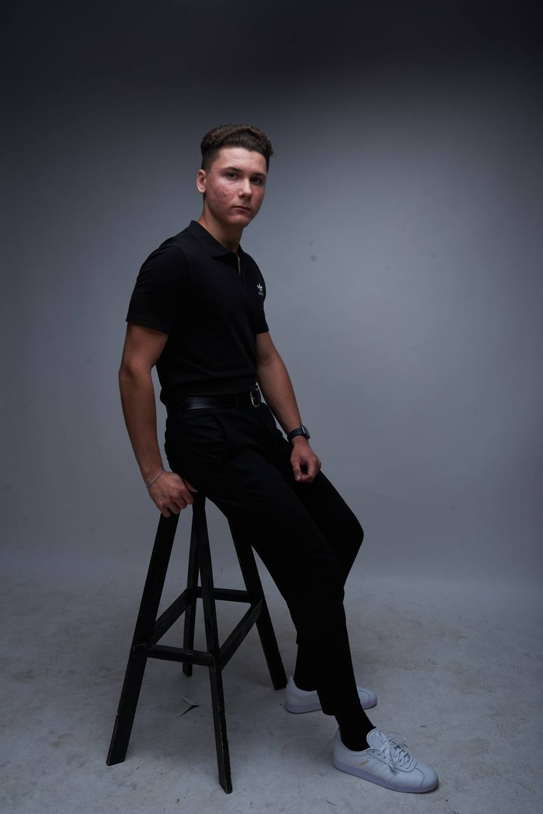

# Матвей Шинкарёв 



## Личная информация
- Имя: Матвей
- Фамилия: Шинкарёв
- Дата рождения: 21.06.2004
- Адрес: г. Могилёв, РБ


## Образование
- Учебное заведение: Белорусско-Российский университет
- Степень: Бакалавр
- Специализация: Инженер-программист
- Год окончания: 2026


## Опыт работы
- Компания: Burger King
- Должность: Курьер
- Период работы: 2023-2024


## Языки
1. Русский (носитель)
2. Белорусский (носитель)
3. English (В2 level)


## Технические навыки
- Язык программирования C#
- Система контроля версий Git
- Язык программирования Java


## Проекты
- [ToDoApp](https://github.com/rvitalina/ToDoApp)


## Пример кода

```java
public class Main {
  public static void main(String[] args) {

    Scanner in = new Scanner(System.in);

    System.out.println("Введите х - натур. число:");
    int x = in.nextInt();
    System.out.println("Введите у - натур. число:");
    int y = in.nextInt();

    in.close();

    float result = (float) x / y;
    int intResult;
    intResult = x / y;

    int rest = x - intResult * y;

    System.out.println("Результат деления нацело: " + result);
    System.out.println("Остаток от деления: " + rest);
    System.out.println("Корень из x: " + Math.sqrt(x));
  }
}
```

### Контактная информация:
- Телефон: +375(29)344-16-31
- Эл. почта: shinkarev.matvei@mail.ru
- Telegram: [@m_shink](https://t.me/m_shink)